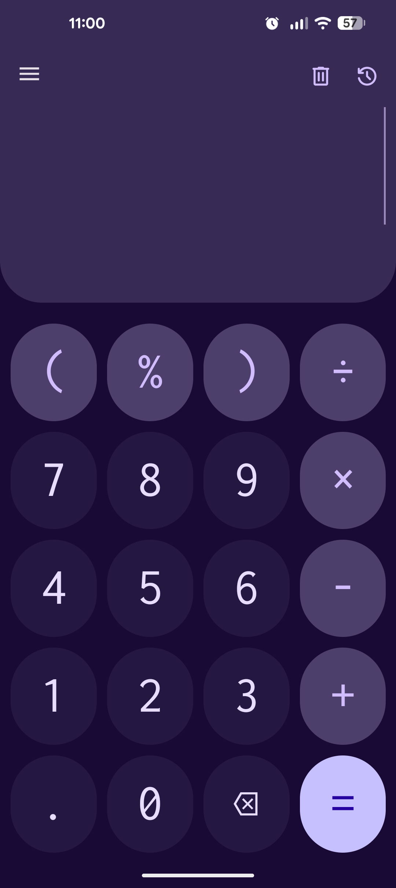
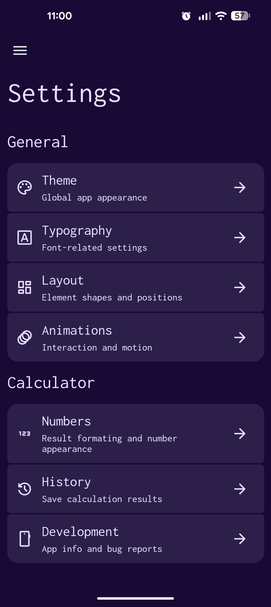
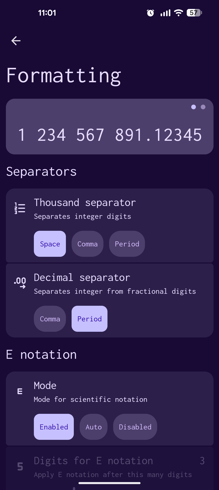
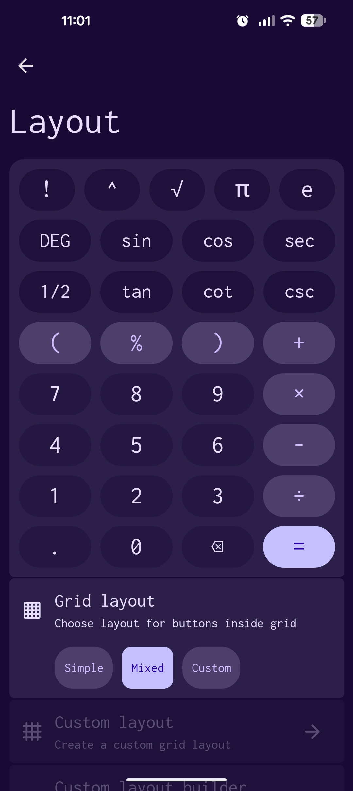
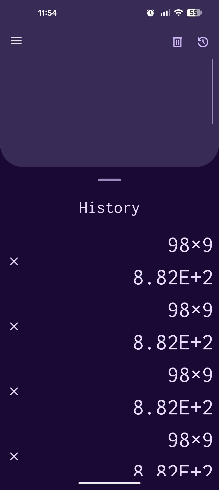

# MCalc

A clean, high-precision calculator for Android, built with .NET 10 MAUI. MCalc prioritizes readability, customization, and the advanced functions most basic mobile calculators leave out.

## Features

### Expression Evaluation

- **Real-time calculation** - results update as you build an expression, not just when you press =
- **Arithmetic operations** - add (`+`), subtract (`-`), divide (`÷`), multiply (`x`)
- **Scientific operations** - power (`^`), square root (`√`), cube root (`∛`), natural log (`ln`), base-10 log (`log`), factorial (`n!`), modulo (`%`)
- **Trigonometric operations** - standard (`sin`, `cos`, `tan`), inverse (`asin`, `acos`, `atan`), reciprocal (`sec`, `csc`, `cot`), their inverses (`asec`, `acsc`, `acot`), and the complete **hyperbolic** set: `sinh`, `cosh`, `tanh`, `csch`, `sech`, `coth`, `asinh`, `acosh`, `atanh`, `acsch`, `asech`, `acoth`
- **Angle modes** - switch between radians (RAD) and degrees (DEG)
- **Constants** - built-in `π` and `e`

### Customizable Keypad

- **Three layouts** - `Simple` (classic phone layout), `Mixed` (adds scientific keys), or `Custom`
- **Fully custom layouts** - design your own keypad in the spreadsheet-style layout editor. Place any function on any cell, arrange keys to your liking, and save it (will be further worked on)
- **Inverse functions at a tap** - toggle between trigonometric and hyperbolic functions and their inverses without cluttering the UI

### Appearance & Theming

- **Material 3 dynamic theming** - seven scheme styles: Vibrant, TonalSpot, Expressive, Rainbow, FruitSalad, Content, Fidelity
- **Wallpaper-based colors** - on Android 12+, pull colors straight from your wallpaper
- **Manual color control** - pick a seed color and MCalc derives the entire palette
- **Light, dark, or auto** - follow the system theme or lock to one
- **Darker mode** - darken the tone of colors to reduce eye strain and save battery
- **Fine-tuned typography** - three monospace fonts or your system font, with independent scaling for input, output, history, and every settings screen (open to changing fonts)

### Usability

- **Expression history** - calculations save after clicking =; tap any entry to recall it
- **Click to copy** - automatically copies expression or result from history into the current calculation
- **Live formatting** - configurable decimal separator (comma or period)
- **Smart E-notation** - force scientific notation on, off, or let it switch automatically by magnitude
- **Configurable animations** - toggle or tune click, transition, and morph animations
- **Readable at a glance** - large, legible input and output

### In-app screenshots

| | | |
|:---:|:---:|:---:|
|  |  |  |
|  |  | |
